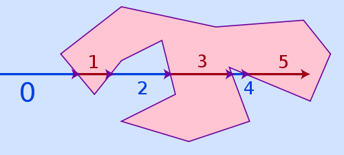
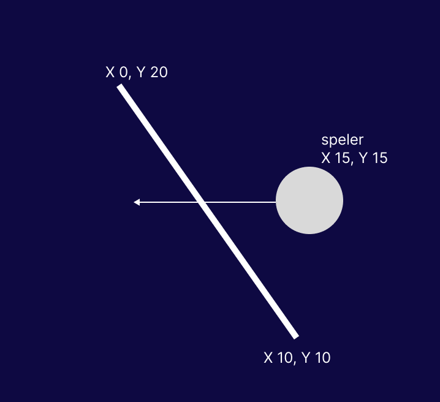
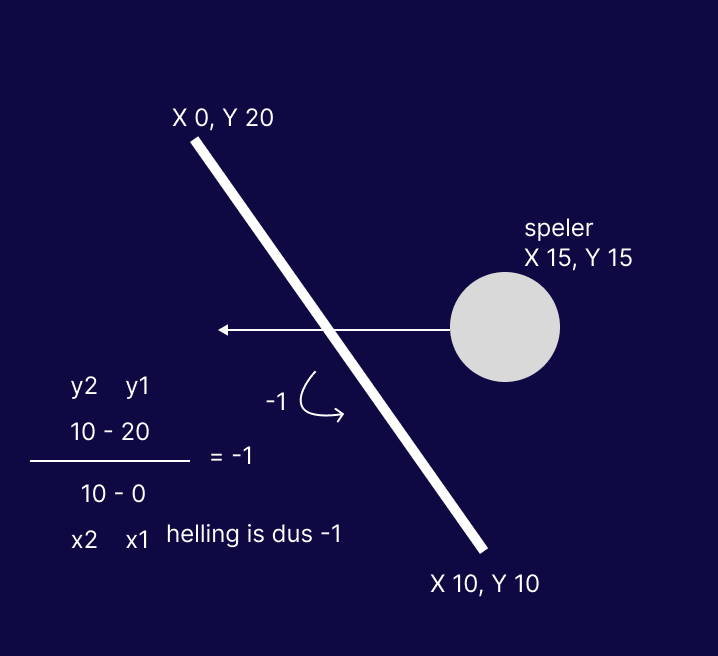
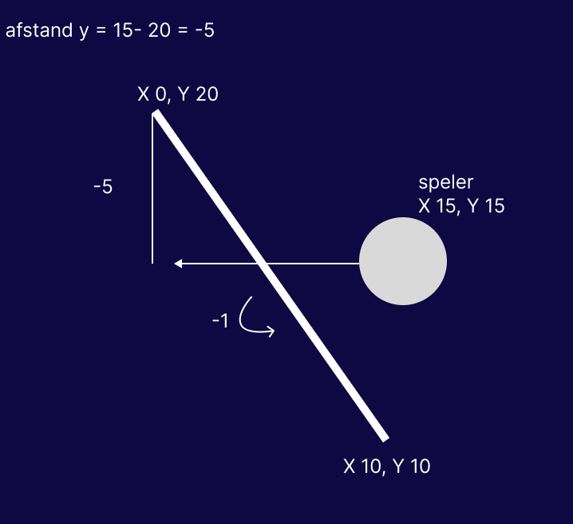
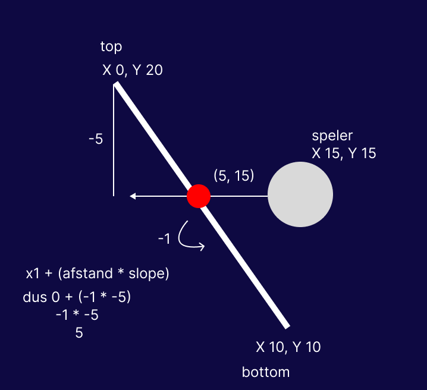

# roll_the_ball

A new Flutter project.


## dit had ik niet tijdens skills kunnen doen zonder hulpmiddelen

### checken of een bal in een map zit

hier de uitleg

ik heb geen moeite gehad met het laten bewegen van de bal, of het creeren van een map.

maar er was wel een probleem, hoe weet ik of een bal in de map zit. met een rect hoek is dat makkelijk.
namelijk dan kan ik de positie van de bal vergelijken de rect.overlaps met de map; maar in het figma design stond een recht een recht hoek met 1 parrellel lijn, met een shift. dus ik heb er toen voor gekozen om de map een polygon te maken. maaar hoe weet ik of een (x, y) in de polygon zit?

dus toen heb ik opgezocht hoe ik dat kon doen, en kwam ik er achter dat ik een ray moet casten en de het aantal keer dat de ray een muur raakt moet tellen. als het oneven is zit de bal in de map, en als het even is zit de bal buiten de map. zie hier een foto van hoe dat werkt:


maar dan is de vraag, hoe weet ik of een ray een muur raakt? want hoe ik en polygon heb gemaakt is een lijst met 
x en y waardes. een daarin kan ik checken of een muur binnen de y waarde van de ray/speler zit. en dan heb ik de muur/muren die binnen de y waarde van de ray/speler zitten. dan ben ik bij de volgende stap zie foto:



hoe berekening ik dan of ik de ray de muur aan raakt. dan moet ik eerst de slope van de muur berekenen, (de helling). dat gaat met de volgende 
formule: 

$$ helling = (y2 - y1) / (x2 - x1) $$



daarna moet ik het verschil (afstand) tussen de y waarde van de ray/speler en de y waarde van het begin van de muur berekenen, dat gaat met deze formule: (y - y1). dat is gewoon muur.topPunt.y - speler.positie.y


met deze waardus kan ik nu de x waarde van het punt waar de ray de muur raakt berekenen, dat gaat met deze formule: x1 + (afstand * slope).
dus collisiePunt.x = muur.leftPunt.x + (afstand * helling)a

$$ collisiePunt.x = muur.leftPunt.x + (afstand * helling) $$


en dan kan ik checken of de x waarde van het collisiePunt binnen de x waarde van de muur zit, dat gaat met deze formule:
$$ speler.dx < collisiePunt.x $$
als dit waar is + 1 bij de count. en dit doe je voor alle muren van de polygon voor elke frame.

dan kun je checken of de count oneven of even is, en zo weet je of de bal in de map zit of niet.


## draaiende muren
draaiende muren zelf toevoegen is geen uitdaging, maar de velocity aanpassen op de speler en het bijhouden van de punten van de muur is wel een uitdaging. 

een muur heeft een paar belangrijke properties, namelijk
- (x, y) positie
- lengte
- duurEnkeleRotatie
- huidigeRotatie (0- 2pi) gaat in radians
- isOmgekeerd
En de speler heeft ook een paar belangrijke properties, namelijk
- (x, y) positie
- (x, y) velocity
- radius


voor de muur moet ik de top en onderste punt bijhouden van de muur.
dus ik heb getters gemaakt die de top en onderste punt van de muur berekenen op basis van de huidigeRotatie en de lengte van de muur.
center = positie van de muur
deze formules zijn als volgt:
$$ topPunt.x = center.x + (cos(muur.huidigeRotatie) * muur.lengte) $$
$$ topPunt.y = center.y + (sin(muur.huidigeRotatie) * muur.lengte) $$
in dart ziet dat er zo uit:
```dart
 Offset get topPoint {
    final double halfLength = length / 2;
    return Offset(
      center.dx + math.sin(currentRotation) * halfLength,
      center.dy - math.cos(currentRotation) * halfLength,
    );
  }
```

$$ onderstePunt.x = center.x + (cos(muur.huidigeRotatie + 180) * muur.lengte) $$
$$ onderstePunt.y = center.y + (sin(muur.huidigeRotatie + 180) * muur.lengte) $$

```dart
 Offset get bottomPoint {
    final double halfLength = length / 2;
    return Offset(
      center.dx - math.sin(currentRotation) * halfLength,
      center.dy + math.cos(currentRotation) * halfLength,
    );
  }
```

daarna moet ik de normaal vector van de muur berekenen, dat gaat met deze formules:
$$ normaalVector.x = cos(muur.huidigeRotatie + 90) $$
$$ normaalVector.y = sin(muur.huidigeRotatie + 90) $$
hierna heb ik het dot product nodig van de normaal vector en de velocity van de speler, dat gaat met deze formule:
$$ dotProduct = (normaalVector.x * speler.velocity.dx) + (normaalVector.y * speler.velocity.dy) $$
deze waarde heb ik nodig om de velocity van de speler aan te passen.
voor de kracht van de muur op de speler moet ik de draaikracht van de muur berekenen.
$$ draaikracht = (2 * pi) / singleRotationDuration.inMilliseconds $$

daarna moet ik de tangentiale snelheid van de muur berekenen.
Dit heb ik nodig om te weten hoe snel de speler mee wordt getrokken door de muur, en dat is afhankelijk van de afstand tussen de speler en de muur.
dat gaat met deze formule:
$$ tangentialeSnelheid = draaikracht * (afstand tussen speler en muur) $$
nu heb je de snelheid met de juiste richting, en kun je de velocity van de speler aanpassen met deze formule
$$ nieuweVelocity = oudeVelocity + (normaalVector * (afstand * wallNormalPush)) + (tangentialeVector * wallTangentialPush) $$

en die nieuwe velocity overschrijf je huidige velocity van de speler mee, en zo wordt de speler mee getrokken door de muur.